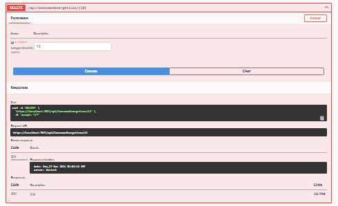

# Projeto BeautyTech

## Integrantes

- **CARLOS EDUARDO MENDONÇA DA SILVA** - RM552164 - 2TDSPV
- **CARLOS ALBERTO MACHARELLI JUNIOR** – RM551677 - 2TDSPV
- **EDUARDO TOSHIO ROCHA OKUBO** – RM551763 - 2TDSPV
- **KAUÊ ALEXANDRE DE OLIVEIRA** – RM551812 - 2TDSPV
- **VITOR MACHADO MIRANDA** – RM551451 - 2TDSPV

## Arquitetura

Usei a **arquitetura monolítica**, onde todo o sistema é implantado em uma única aplicação, com todas as interfaces e funcionalidades interconectadas no projeto. Estou utilizando essa arquitetura porque, ao manter todo o sistema em uma única aplicação, ela facilita o desenvolvimento e o gerenciamento a curto prazo, permitindo que alterações ou correções sejam feitas de forma rápida. Além disso, essa abordagem tem um custo menor em termos de controle e gerenciamento da infraestrutura.

## Padrão Utilizado

- **Repository**: O padrão Repository foi utilizado para abstrair a lógica de acesso a dados e fornecer uma interface para que as camadas superiores do aplicativo possam acessar os dados sem se preocupar com os detalhes de como esses dados são armazenados ou recuperados. Esse padrão ajuda a separar as preocupações de persistência e permite que a lógica de negócio se concentre em regras de negócio, sem estar acoplada diretamente ao banco de dados ou qualquer outra forma de armazenamento.

## Projeto de Monitoramento de Consumo de Energia

O código foi desenvolvido com ênfase nas práticas de Clean Code e nos princípios SOLID, com o objetivo de garantir uma base sólida, manutenível e escalável.

As práticas de Clean Code foram adotadas para tornar o código mais legível e compreensível. Nomes significativos foram escolhidos, métodos pequenos e focados foram aplicados, evitando-se duplicação de código, e comentários foram utilizados de forma eficaz. Cada classe foi projetada com uma única responsabilidade, facilitando a manutenção e a compreensão.

Os princípios SOLID foram seguidos para criar um código modular e flexível. As classes estão abertas para extensão, mas fechadas para modificação, permitindo a adição de novos modelos sem alterar a lógica existente. A utilização de interfaces específicas garante que os clientes não dependam de métodos que não utilizam, promovendo a flexibilidade do sistema.

A dependência de abstrações, e não de implementações concretas, foi assegurada por meio da injeção de dependência, o que aumenta a flexibilidade, a testabilidade e a manutenção do código. Como resultado, o código se torna mais legível, facilitando a colaboração em equipe e permitindo a implementação ágil de novas funcionalidades.
## Instruções para Rodar a API:

### Passos para Execução

1. **Clone o repositório do github**:
2. **Banco de Dados**: Configure o banco de dados que será utilizado pela API e atualize a string de conexão no arquivo `appsettings.json`.
3. **Criar migrations**: Rode no cmd "dotnet ef migrations add InitialCreate".
4. **Banco de Dados**: Aplique as alterações no banco "dotnet ef database update".
5. **Projeto**: Rode o projeto.
6. **SWAGGER**: Voce ira acessar o Swagger em um caminho semelhante a esse https://localhost:7071/swagger/index.html.

### TESTES SWAGGER

- **POST-ML**

- **POST**

- **GET**
  

- **GET ID**
  

- **PUT**
  

- **DELETE/SELECT**
  

